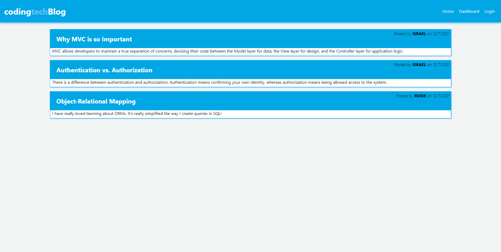
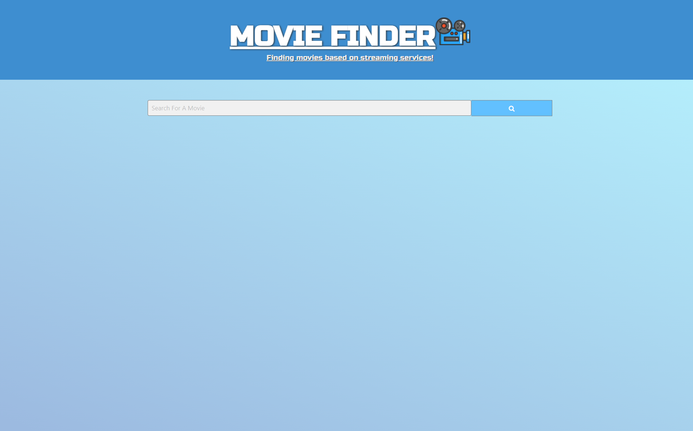

# Israel Rios' GitHub Portfolio


Software Engineer with a Certificate in Full-Stack Development and a Bachelor's Degree in Information Management. Recent experience in JavaScript, CSS, Node.js, React.js, and responsive web design. Also have experience and knowledge in business administration & information systems. Detail oriented and hard working teammates focused on completing projects on time and above expectation. Applied aspects of UX and agile development in a recent project where I collaborated in a team of four to develop a single-page app that helps users find movies on different streaming services and provides a description of that movie. I am looking forward to making a difference utilizing my skill sets and experience in a full application lifecycle.

## Examples of Work

[](https://github.com/anun05/nft-generator.git)
> **Note**: You can find the NFT Generator Application here&mdash; https://github.com/anun05/nft-generator.git

[](https://github.com/israelmrios/Coding-Tech-Blog.git)
> **Note**: You can find the Coding Tech Blog Application here&mdash; https://github.com/israelmrios/Coding-Tech-Blog.git

[](https://israelmrios.github.io/Movie-Finder/)
> **Note**: You can find the Movie Finder Application here&mdash; https://israelmrios.github.io/Movie-Finder/

[](https://israelmrios.github.io/Weather-Dashboard/)
> **Note**: You can find the Weather Dashboard Application here&mdash; https://israelmrios.github.io/Weather-Dashboard/

[](https://israelmrios.github.io/Work-Day-Scheduler/)
> **Note**: You can find the Work Day Scheduler Application here&mdash; https://israelmrios.github.io/Work-Day-Scheduler/

## Skills

```
* JavaScript
* jQuery
* HTML
* CSS
* Bootstrap
* Node.js
* MySQL
* mongoDB
```

## Contact Me
[](mailto:israelm.riosjr@gmail.com) [](https://github.com/israelmrios) [](https://www.linkedin.com/in/israel-m-rios-jr-93a81a38//)

## Resources Used
* [GitHub](http://github.com)
* [MDN Web Docs](https://developer.mozilla.org)
* [W3 Schools](https://www.w3schools.com/)
* [Request-Response](https://coding-boot-camp.github.io/full-stack/github/professional-readme-guide)
* [Google Fonts](https://fonts.google.com/)
* [Subtle Patterns](https://www.toptal.com/designers/subtlepatterns/)

## License
Copyright (c) 2021 Israel M Rios.
Licensed under the [MIT License](LICENSE).